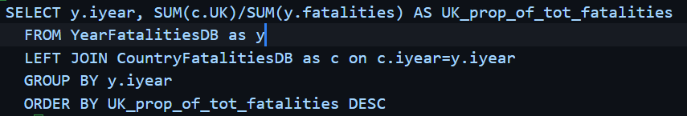
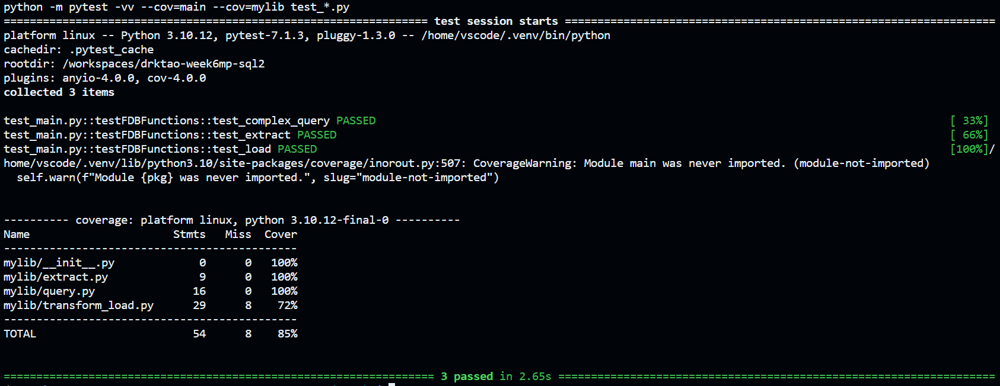

## SQL Complex Query
The purpose of this project is to execute a complex SQL query of data stored in Azure Databricks. The following steps are taken:
1. `extract.py` - extracts a dataset from a URL and creates a file path within the repo
2. `transform_load.py` - transforms and loads the dataset into Databricks SQL warehouse
3. `query.py` - performs a complex query on the data

In order to establish a connection to Databricks, the repo stores the necessary Databricks secrets, including ACCESS_TOKEN, HTTP_PATH, and SERVER_HOSTNAME. To perform data extraction, loading, and querying, simply run `python main.py` in the terminal

The following is the complex query that is performed:

YearFatalitiesDB contains the total number of fatalities from EU terrorism from the years 1986-2014. CountryFatalitiesDB contains the number of fatalities from EU terrorism for several European countries from the years 1970-2014. We perform a left join of YearFatalitiesDB with CountryFatalitiesDB on the iyear column. Then, we consider just the columns containing year, fatalities from the United Kingdom. and total EU fatalities. We group these data by year (in this case, aggregation is not necessary since there is only one row for each year, but if there were multiple rows for certain years, then aggregation would be necessary to perform our desired operations correctly). We then calculate the proportion of total EU fatalities that came from the UK for each year, and order these proportions from greatest to least. The results of this query can be used to examine temporal trends in the rate of EU terrorist fatalities that occur in the UK specifically, as well as which years have the highest and lowest of such rates. When running this query in codespaces, here are the results:

Below is a log of the successful tests from `test_main.py`:

